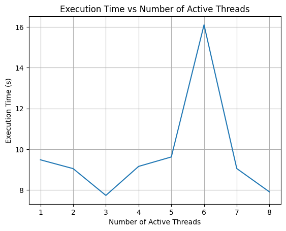

# Matrix Multiplication Benchmark

## Introduction

This project benchmarks the execution time of matrix multiplication using different numbers of threads in Python.

## Methodology

The matrix multiplication benchmark was conducted using the following methodology:

1. **Matrix Multiplication Function**: A function `multiply_matrices` was defined to perform matrix multiplication using NumPy's `dot` function.
2. **Constant Matrix Generation**: A random constant matrix of size 1000x1000 was generated.
3. **Multiple Threads**: Multiple threads were created to perform matrix multiplication concurrently.
4. **Execution Time Measurement**: The execution time for each thread was recorded using the `time` module.
5. **Plotting and Tabulation**: The execution times were plotted against the number of active threads using Matplotlib. Additionally, a table was created using PrettyTable to display the execution times for each thread.

## Results

### Execution Time vs Number of Active Threads

The following graph shows the execution time (in seconds) versus the number of active threads:

### Execution Time Table

The table below presents the execution times (in seconds) for each number of active threads:

| Number of Threads | Time Taken (s)    |
|-------------------|-------------------|
| 1                 | 9.479106187820435 |
| 2                 | 9.04660940170288  |
| 3                 | 7.730104446411133 |
| 4                 | 9.155450582504272 |
| 5                 | 9.619330167770386 |
| 6                 | 16.10832953453064 |
| 7                 | 9.05103611946106  |
| 8                 | 7.902407646179199 |

The table and graph provide insights into the performance of matrix multiplication with varying numbers of threads.

## Dependencies

The following dependencies are required to run the notebook:

- Python 3.x
- NumPy
- Matplotlib
- PrettyTable
